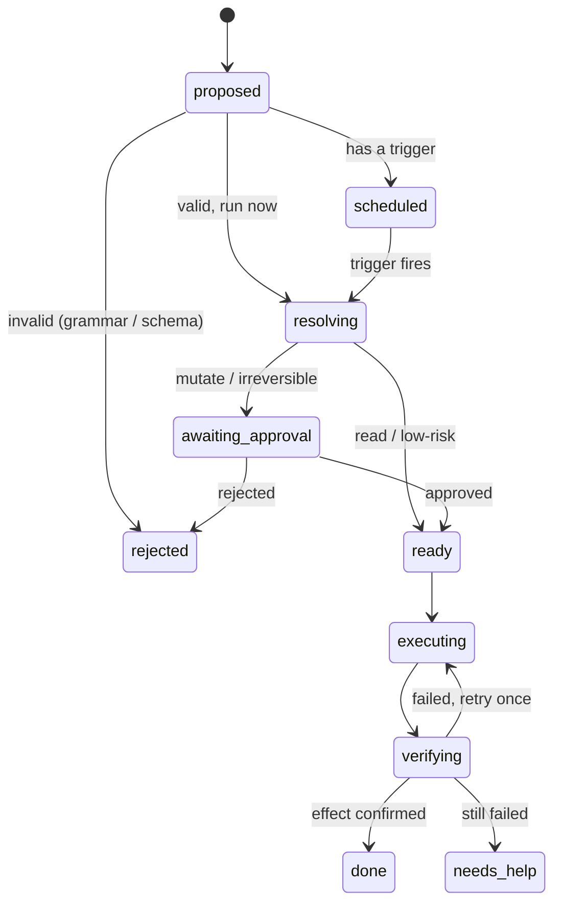
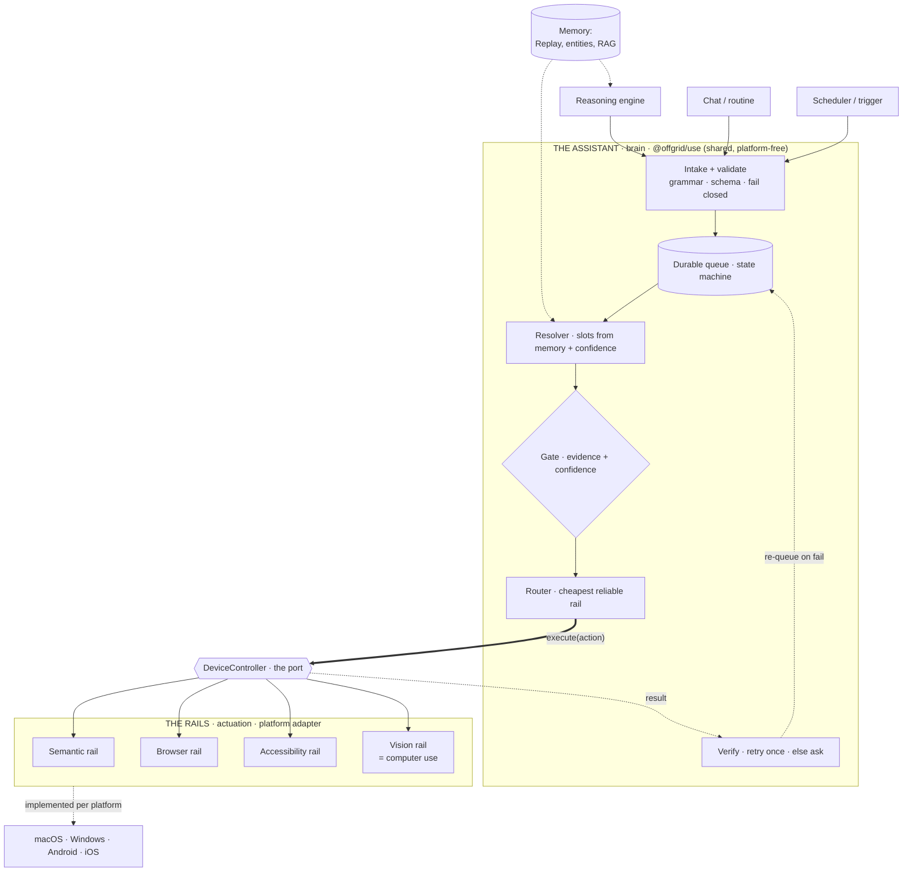
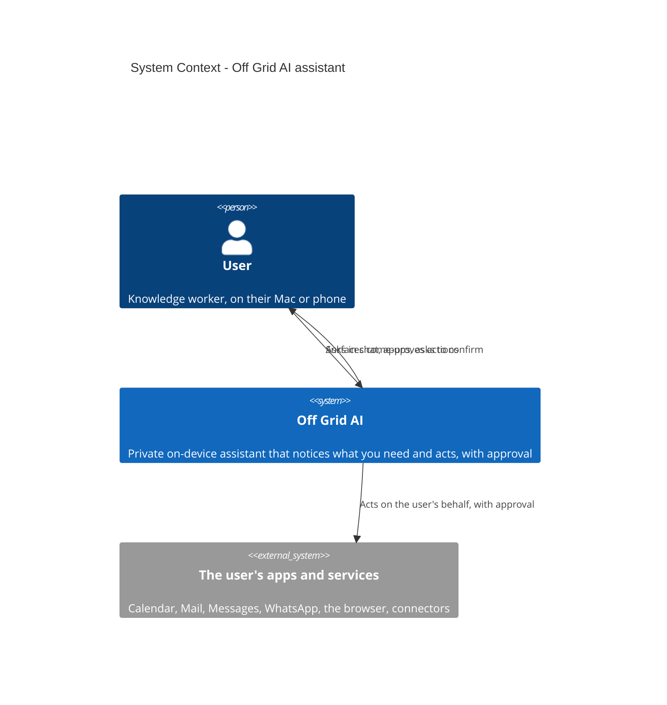
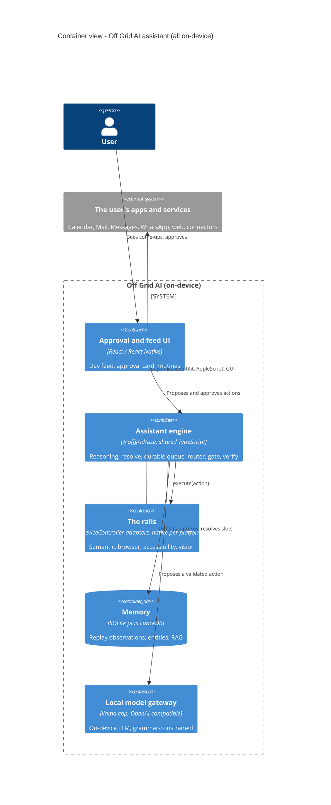
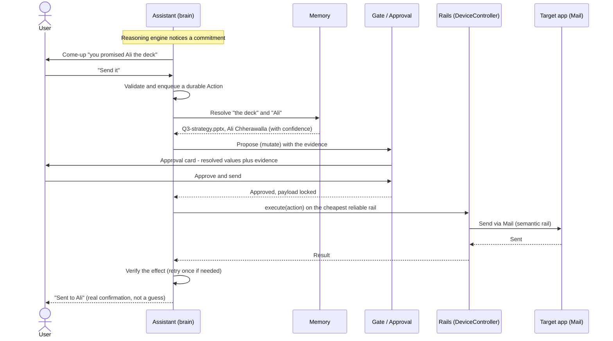
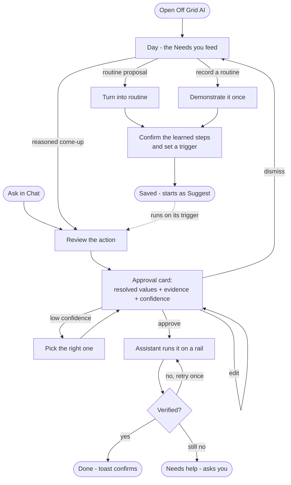

# The assistant - system architecture (the act pipeline)

**Status:** high-level design, August 13, 2026, from the architecture discussion. For team review.
Companion to `COMPUTER_USE.md` (the product model), `COMPUTER_USE_PLAN.md` (the plan), and `COMPETITIVE_RESEARCH.md` (prior art). This doc is about the *system that executes actions* - how it stays reliable on a weak local model and identical across desktop and mobile.

---

## 1. The problem this design solves

Two hard constraints shape everything:

1. **Local models are unreliable at tool-calling.** A bundled small model malforms calls, hallucinates arguments, or answers in prose instead of calling the tool. We cannot couple "decide" and "do" in a single model turn, or a bad turn means a lost or half-done action.
2. **The core must be identical on desktop and mobile.** We do not want two implementations of the thing that decides and guarantees actions.

The design below answers both: a durable action pipeline where the model is the least-trusted component, wrapped by deterministic machinery that guarantees execution.

## 2. The core reframe: the model proposes, the pipeline guarantees

Most agent systems fail because the model both decides and executes in one turn. We invert it:

**The model only ever proposes a structured Action. A durable, deterministic pipeline guarantees it happens - exactly once, gated, verified.**

The model does the smallest, most-constrained job (produce a valid Action), and everything downstream is deterministic. A bad proposal is caught at a validation boundary and discarded (fail closed); a good proposal is executed with exactly-once guarantees and effect-verification. This is the tenet the whole system rests on:

> **Reliability lives in the system, not the model.**

A capable model makes the *proposals* better (fewer rejections, better resolution). It never changes whether an approved action actually executes. That is what lets us swap in a smaller or fine-tuned model later with no change to the guarantee.

## 3. The Action: a durable record and a state machine

Everything - a proactive come-up, a tool the chat model called, a routine step, a scheduled trigger - normalizes into one durable **Action** record in local SQLite. That store is the queue.

An Action carries: `id`, `type` (message / email / calendar / open / file-share / web-task / ...), `source` (reasoning / chat / routine / schedule), `intent` (the natural-language ask), `args` (resolved slots), `payloadHash` (the immutable contract of exactly what will run), `risk` (read / navigate / mutate / irreversible), `rail`, `idempotencyKey`, `attempts`, `verification`, `state`, `triggerAt`, and audit references.

It moves through a persisted state machine:

Because the record is persisted, not a transient turn: a crash resumes it, a scheduled action waits durably, a retry does not double-send (idempotency), and an action is not `done` until its effect is verified. This durability is also exactly why the pattern fits mobile - a queue drained by a background worker survives the OS killing the app, which mobile does aggressively.

## 4. The reliability stack (how it survives a weak model)

Layered, weakest-model-work first:

1. **Constrain the output.** Grammar-constrained decoding (GBNF) so the model can only emit a valid Action on valid arguments. For GUI steps, generate the grammar per step so it can only pick elements that exist right now.
2. **Validate at the boundary, fail closed.** A malformed or off-schema proposal never becomes an Action. Keep the action schema small and closed (fewer types = far better local accuracy); rank and prune available tools to the token budget.
3. **Decouple decision from execution.** The durable queue means a bad turn is a no-op, not a lost or half-done action.
4. **Bind the executed payload to the approved one.** The `payloadHash` the gate showed is exactly what runs - no re-resolution between confirm and act.
5. **Prefer determinism over the model.** Route to semantic rails and recorded traces first; the model does the least, most-constrained work, least often. Vision/GUI is the last resort.
6. **Verify, then retry once, then ask.** Observe the effect. If it did not happen, retry once; if it still did not, mark `needs_help` and surface it rather than looping.

## 5. Focused, not general: a registry of typed action handlers

Per the lead's steer, the assistant is not a general "call any tool" agent - it is a **curated set of first-class action types**, each with its own schema, grammar, resolver, rail, and verification. Adding a capability = adding a handler, not retraining anything.

The v1 scope (things you do on your own machine), grouped by type and honest about reliability tier:

| Action type | Examples | Rail | Reliability in v1 |
| --- | --- | --- | --- |
| Message | send a text | semantic (AppleScript / iMessage) | high |
| Email | send / compose | semantic (Mail, or Gmail connector) | high |
| Calendar and reminders | create event / reminder | semantic (EventKit) | high |
| Open / launch | open tabs, a URL, a YouTube video, an app | semantic (deep link / open) | high |
| Look up | contacts, "what's on my calendar" | semantic (read, inline) | high |
| File share | share a file over WhatsApp | GUI vision (Catalyst, dead AX tree) | best-effort, supervised |
| Web task | flight check-in, book a hotel, order | agent browser + takeover | best-effort, supervised |
| Proactive notice | "flight tonight, not checked in", "you promised the deck" | reasoning engine -> feeds the above | new, memory-driven |

The pipeline is identical across all of them; only the rail and the reliability differ. Two tiers to set expectations honestly: **semantic actions (text, email, reminders, open) are solid; GUI and web tasks (WhatsApp file share, check-in, booking) are supervised and improving.** Same product, honestly tiered.

## 6. One core, two platforms

The pipeline is the `@offgrid/use` engine in `shared` (consumed as `file:../shared/packages/use`). The reliable parts are pure logic, so they are shared; only the platform-specific edges are adapters.

**Naming (canonical).** Two layers: **the assistant** (the brain - reasoning, resolve, the queue, the router, the gate, verify) and **the rails** (the actuation layer - the executors that actually perform actions, behind the `DeviceController` interface). Each concrete path is a rail: the **semantic rail**, the **browser rail**, the **accessibility rail**, and the **vision rail**. "Computer use" means the vision rail specifically, not the whole layer - most actions never touch it.

**The shape, at a glance.** This is a component diagram in the **ports-and-adapters (hexagonal)** pattern: the assistant is the core, the `DeviceController` is the port, and the rails are the swappable adapters implemented per platform.

**Shared core (platform-free):** the Action model + durable queue + state machine; the reasoning engine (commitment / gap detection); the resolver (slot-filling over memory, with confidence); the router (cheapest reliable rail); verification + retry / idempotency policy; the action-handler registry; the gate seam (a callback the host implements).

**Per-platform adapters (behind interfaces the core calls):**
- **The rails (behind the `DeviceController` interface)** - how to actually run a thing. Desktop: the Swift helper (EventKit / AppleScript), the agent browser, AX + synthetic input, vision. Android: intents + content providers + an accessibility-service portal. iOS: App Intents / Shortcuts only (no GUI or vision rail - the platform forbids reading or driving other apps).
- **MemoryStore** - read observations / entities / RAG.
- **Scheduler** - fire time and event triggers.
- **Approval and feed UI** - render the gate and the come-up feed (desktop renderer; mobile React Native).
- **Model client** - both call the local model through the OpenAI-compatible gateway.

So "the core stays the same" is concrete: the queue, resolver, router, reasoning, and verification are one codebase; only the executor, store, scheduler, and UI are swapped per platform. Mobile is an adapter project on the same engine, not a rewrite.

---

## 7. Decisions locked (present these as answered)

1. **The model proposes, the durable queue guarantees.** Decision-and-execution are separated. The model produces a validated Action; the pipeline executes it. This is what makes the system reliable on a weak model.
2. **Reliability lives in the system, not the model.** The execution guarantee comes from the pipeline (constrain, validate, queue, deterministic rails, verify), never from the model being good.
3. **Model choice: capable now, model-agnostic pipeline, fine-tuning deferred.** We start with a good, capable model to prove the experience feels right. The pipeline is built to hold with a smaller model, so the bundled model (or a future LoRA fine-tuned on our action schema) slots in with zero change to the guarantee. Fine-tuning is an optional later reliability boost, not a v1 dependency.
4. **The queue lives in `shared` (`@offgrid/use`).** The queue engine and state machine are platform-free core; the storage and UI are platform adapters. This keeps the execution guarantee identical on desktop and mobile.
5. **Mutations go through the queue and gate; reads run inline.** Anything that changes the world (send, create, delete) - even when asked in chat - flows through the durable pipeline. Pure reads ("what is on my calendar") can run inline for latency, since there is nothing to guarantee. To the user this is invisible; chat can still act, it is just durable and gated underneath.
6. **Retry once, then ask.** On a verified failure, retry a single time; if it still fails, stop and surface `needs_help` rather than looping.
7. **The gate shows resolved values, evidence, and confidence, bound to the approved payload.** The approval card shows what was inferred and why ("Send Q3.pptx to Ali because ..."), and the exact payload approved is the exact payload that runs.
8. **Cheapest reliable rail first, vision last.** The router prefers a deterministic surface (deep link / API / AppleScript) over the agent browser over the accessibility tree over the vision-grounding model.
9. **Scope: a curated set of typed action handlers** (Section 5), spanning two honest reliability tiers - semantic actions are solid, GUI / web tasks are supervised.

## 8. Open questions (for the team) - explained

Each is a real decision with a tradeoff. Where we have a lean, it is stated so the team reacts to a proposal rather than a blank.

### 8.1 Exactly-once per rail
**What it is.** The guarantee that an action runs one time and only one time, even across a retry or a crash. Example: the executor sends an iMessage, then the app crashes before recording success; on restart it must not send a second copy.
**Why it matters.** Double-sending a message, or creating two calendar events, is a visible, trust-damaging failure - worse than a clean failure.
**Options.** (a) *Idempotency key* - tell the target "this is operation X, ignore a duplicate" (works only if the target supports it). (b) *Check-before-act* - before creating, ask "does this already exist?" (c) *Verify-after* - after the attempt, look for the effect and only retry if it is missing. Feasibility is per-rail: calendar / reminders / mail are verifiable and roughly idempotent; iMessage / WhatsApp / a website form are fuzzy (no key, and "did it send?" is hard to answer cleanly).
**The decision.** Do we require every action handler to declare a verification or existence-check capability? And for the fuzzy rails, is the policy single-attempt-behind-the-gate, or verify-then-accept-a-small-residual-risk?
**Our lean.** Handlers declare how they verify; reversible actions retry-once with verify; irreversible fuzzy actions (an outbound send) are single-attempt behind the gate, so a wrong verify can never double-fire.

### 8.2 Scheduling and triggers
**What it is.** How a routine fires at 09:00, or an event trigger fires ("when I open Slack", "20 minutes before a meeting").
**Why it matters.** Proactive delivery and routines depend on triggers, and they must work when the app is backgrounded or killed - especially on mobile, where the OS controls wakeups.
**Options.** (a) *Core-owned trigger model* - the shared core holds the trigger definitions and a durable schedule table, and a thin platform adapter wakes the worker (launchd / a timer on Mac, WorkManager / BackgroundTasks on mobile). (b) *Platform-native scheduling wrapped* - each OS's scheduler owns the timing, the core just registers callbacks.
**The decision.** How much scheduling logic lives in the core vs the OS, and how we survive the app being closed.
**Our lean.** Core owns the trigger model and the durable schedule; a thin per-platform adapter is responsible only for waking the worker at the right time.

### 8.3 Trust graduation (Suggest to Auto)
**What it is.** When an action or routine moves from Suggest (ask before each run) to Auto (runs unattended).
**Why it matters.** This is the whole "proactive but safe" arc. Too eager feels invasive or dangerous; too timid and it never saves time.
**Options.** (a) *Per action type* - reads auto, sends always ask. (b) *User-set per routine* - a manual Suggest/Auto toggle. (c) *Confidence threshold* - auto when confidence is high and the action is reversible. (d) *Learned* - auto after N successful approvals of the same shape.
**The decision.** What is the default, who controls the dial, and do irreversible actions ever run Auto.
**Our lean.** Default Suggest; the user promotes a routine to Auto; irreversible actions always gate even inside an Auto routine; reversible high-confidence actions may auto after a few confirmations.

### 8.4 Mobile v1 target
**What it is.** What actually ships on mobile first, given the same core but very different rails.
**Why it matters.** The rail capabilities differ enormously by platform, and this sets expectations. Android can host the full stack (an accessibility-service portal plus intents and content providers). iOS is intents-only - Apple forbids an app from reading or driving other apps, so there is no GUI or vision rail there. Also, the mobile app does not consume the shared monorepo yet, which is a prerequisite regardless.
**The decision.** Is mobile v1 Android-first (full experience), iOS-first (intents-only, limited), or desktop-only for v1 with mobile as a fast-follow - and on what timeline.
**Our lean.** Desktop v1; mobile as an adapter project afterward, Android-first for the full experience, iOS shipped as intents-only with honest scope.

### 8.5 Open-core placement
**What it is.** Which parts of the pipeline are open core (AGPL, in `shared` / the public repo) vs pro (in `desktop-pro`).
**Why it matters.** Open-core is a hard rule - pro business logic must not live in core. The reasoning engine, the resolver policy, the approval-queue UI, and routines are the "act pillar" and follow the existing pro spine; the rail primitives and the queue engine are closer to infrastructure.
**The decision.** Draw the line: what is the inert core shell vs the pro business logic.
**Our lean.** The queue engine, the action-handler interfaces, and the rail primitives live in `shared` / core (infrastructure); the reasoning engine, the resolver's policy, the approval and feed UI, and routines live in `desktop-pro`.

### 8.6 Verification depth per rail
**What it is.** How thoroughly we confirm an action's effect actually happened before marking it `done`.
**Why it matters.** Verification is what makes retry-once safe and catches silent failures and false confirmations (the field's number-one trust failure is an agent saying "done" when the backend failed).
**Options.** (a) *None* - trust the executor's return. (b) *Light* - parse the return / status. (c) *Full re-observe* - query the world (is the event in the calendar, is the mail in Sent, re-read the AX tree or screenshot). Cost vs safety, and it differs per rail.
**The decision.** The minimum verification bar per rail, and whether irreversible or GUI actions require full effect-verification.
**Our lean.** At least "executor reported success and the effect is observable" for every mutation; full re-observe for irreversible actions and for the GUI / vision rail, where drift is most likely.

---

## 9. How to present this

The narrative for the team: the vision (the demo) is validated; the scope is a curated set of action types across two honest reliability tiers; the system is a durable action pipeline where the model only proposes and the pipeline guarantees, so it survives a weak local model and stays identical on desktop and mobile; the decisions in Section 7 are locked; and Section 8 is the six open questions we want the team to weigh in on. The natural next step after alignment is the detailed `@offgrid/use` spec - the Action schema, the handler interfaces, and the reliability policy in code form.

---

## 10. System architecture diagrams (C4, swimlane, user flows)

The TRD / PRD deliverables, in the standard house style. The component diagram in Section 6 is the C4 **component** level (Level 3); the two views below add the **context** (Level 1) and **container** (Level 2) levels above it, then a runtime swimlane and the product user flows.

### 10.1 System context (C4 - Level 1)

Who uses the system and what it touches. The assistant is on-device; the only external things are the user and the apps and services it acts on.

### 10.2 Containers (C4 - Level 2)

The parts inside Off Grid AI and how they talk. The assistant engine is the brain; the rails are the hands; everything runs on-device.

### 10.3 Sequence / swimlane

Swimlane by actor: it makes clear who is responsible at each step, and which part of the system assists the user. Example flow: the user acts on a proactive come-up ("send the deck I promised Ali"). The lanes are the actors: User, Assistant, Memory, Gate, Rails, and the target app.

For a GUI action (say a WhatsApp file share) the same lanes hold; only the rail changes to vision, and the target app is driven step by step with a pause at the send.

### 10.4 User flows

The paths a user can take through the product: the two entry points (the proactive Day feed, or asking in Chat) through the gate to a verified result, plus the two ways a routine is born.

Two entry points - the proactive Day feed and Chat. Both land on the approval card, which shows the resolved values with their evidence and confidence; low confidence branches to a quick "which one did you mean" pick. Approve runs it on a rail, then verify decides done, retry-once, or ask you. A routine is born two ways - the assistant proposes a detected pattern, or you record one by demonstrating it - both converge on confirming the learned steps and setting a trigger, and a saved routine starts as Suggest until you trust it.
