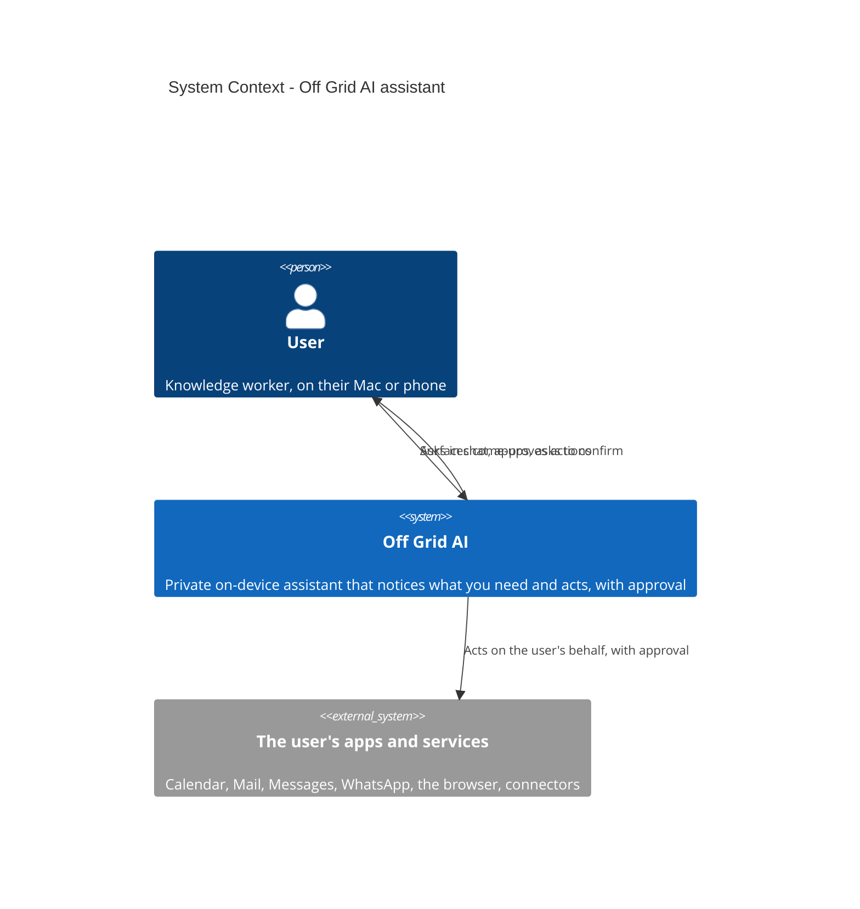
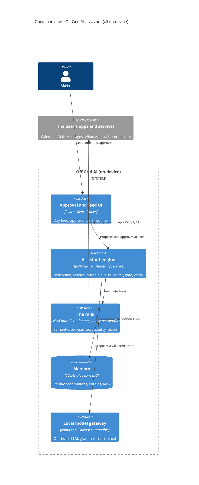
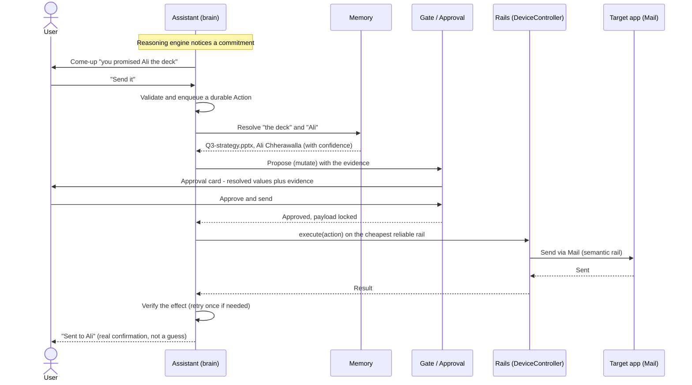
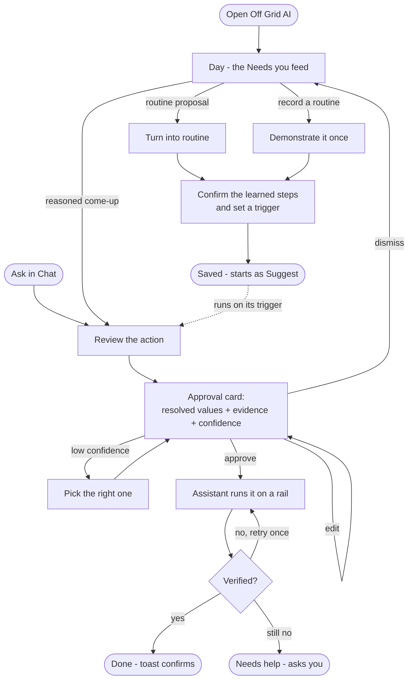

# Off Grid AI - the assistant: TRD / PRD diagrams

**Status:** August 13, 2026. Diagrams for the assistant (the act pillar), in the Wednesday TRD + PRD house style.
These slot into the standard docs: **System Architecture (C4)** and **Sequence / Swimlane** go in the TRD; **User Flows** goes in the PRD. Companion to `ASSISTANT_ARCHITECTURE.md` (the full system design) and `COMPUTER_USE.md` (the product model). All diagrams are Mermaid, so they render on GitHub, in the Mermaid Live Editor (for a PNG/SVG export into the Google Docs), and in an artifact.

---

## 1. System Architecture (C4 model)

### Level 1 - System Context

Who uses the system and what it touches. The assistant is on-device; the only external things are the user and the apps and services it acts on.

### Level 2 - Containers

The parts inside Off Grid AI and how they talk. The assistant engine is the brain; the rails are the hands; everything runs on-device.

A Level 3 (component) view of the assistant engine - intake, queue, resolver, router, gate, verify - is the component diagram in `ASSISTANT_ARCHITECTURE.md`.

---

## 2. Sequence / Swimlane

Swimlane by actor: it makes clear who is responsible at each step, and which part of the system assists the user. Example flow: the user acts on a proactive come-up ("send the deck I promised Ali"). This is the reliable path - the model only proposes, the pipeline guarantees.

The lanes are the actors: **User**, **Assistant** (brain), **Memory**, **Gate**, **Rails**, and the **target app**. For a GUI action (say a WhatsApp file share) the same lanes hold; only the rail changes to vision, and the target app is driven step by step with a pause at the send.

---

## 3. User Flows

The paths a user can take through the product, from the two entry points (the proactive Day feed, or asking in chat) through the gate to a verified result, plus the two ways a routine is born.

**Reading it:** two entry points - the proactive **Day** feed and **Chat**. Both land on the **approval card**, which shows the resolved values with their evidence and confidence; low confidence branches to a quick "which one did you mean" pick. Approve runs it on a rail, then **verify** decides done, retry-once, or ask you. Separately, a routine is born two ways - the assistant proposes a detected pattern, or you record one by demonstrating it - both converge on confirming the learned steps and setting a trigger, and a saved routine starts as **Suggest** (asks before each run) until you trust it.

---

## Notes for dropping these into the Google Docs

- To get a PNG or SVG for the TRD / PRD, paste any block above into https://mermaid.live and export.
- The C4 diagrams use Mermaid's native `C4Context` / `C4Container` types, so they are true C4, not a flowchart dressed up as one.
- The swimlane is a sequence diagram (each participant is a lane) - the TRD allows either; sequence is the better fit here because it shows which part of the system assists the user at each step.
