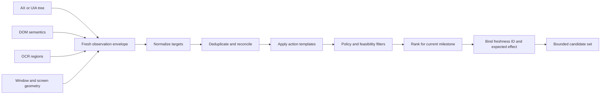
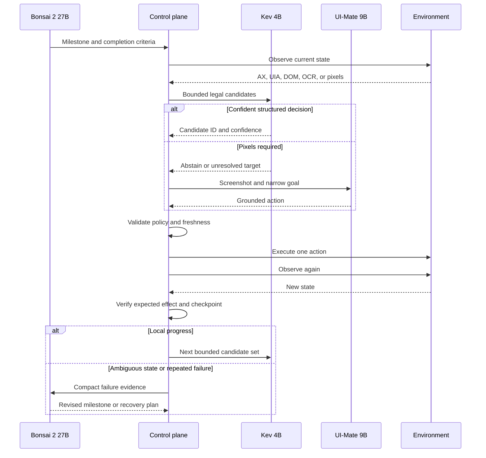
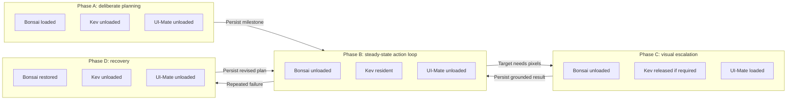

# Cognitive Sharding: A Systems Architecture for Computer Use on Consumer Hardware

## Abstract

Computer-use agents commonly assign perception, planning, action selection, and recovery to one large multimodal model. This design is simple, but it makes every interaction pay the memory and latency cost of the hardest interaction. It also couples unrelated failure modes inside one model call.

This note describes **Cognitive Sharding**, a system-level architecture that assigns distinct cognitive functions to specialist models inside one agent. The [OGAD reference implementation](https://github.com/off-grid-ai/OGAD) uses Bonsai 2 27B for deliberate reasoning and planning, Kev 4B for fast System 1 decisions, and UI-Mate 9B for visual grounding. An authoritative, code-owned control plane manages state, routing, execution, verification, and recovery. Model weights are loaded on demand when the hardware cannot keep all shards resident.

The architecture runs locally on a 16 GB consumer computer. Models have bounded authority, task state survives model swaps, and each action is verified against the environment before execution continues.

## 1. Introduction

A computer-use agent must perform several different forms of cognition:

- interpret a user goal;
- create and revise a plan;
- select the next action from the current state;
- locate controls that exist only in pixels;
- execute an action safely;
- determine whether the action had the expected effect; and
- recover when the environment differs from the plan.

These operations do not have the same compute requirements. Planning across an uncertain task needs a capable reasoning model. Selecting one valid action from a bounded set is a smaller classification problem. Mapping a visual control to screen coordinates needs a grounding model, but often does not need the complete task history.

Cognitive Sharding treats these operations as separate workloads. It gives each workload to the smallest suitable model and connects the models through shared, durable state.

> **Definition.** Cognitive Sharding is an agent systems architecture that partitions cognitive functions across specialist models and coordinates them through an authoritative, code-owned control plane.

This is different from a neural Mixture of Experts, where expert networks are internal parts of one model. It is also different from a multi-agent system, where autonomous agents own separate goals and communicate with each other. Cognitive shards are models with narrow authority inside one agent and one execution state machine.

### Contribution and scope

Planner–executor separation, semantic UI control, model routing, verification, and model swapping provide the foundations. Cognitive Sharding composes them for constrained local hardware:

> **A bounded-authority planner–selector–grounder architecture with transactional model residency and environment-verified recovery.**

The specific models are one implementation of that architecture. The primary engineering contribution is the control plane that limits their authority, preserves state across model swaps, builds legal actions, and verifies effects against the environment.

## 2. Architecture

The reference architecture has four principal layers: observation, cognitive shards, the control plane, and actuation.

[OGAD](https://github.com/off-grid-ai/OGAD) currently uses [Bonsai 2 27B](https://huggingface.co/prism-ml/Ternary-Bonsai-2-27B-gguf) for reasoning and planning, [Kev 4B](https://huggingface.co/jaredpalmer/kev-4b) for fast action selection, and [UI-Mate 9B](https://huggingface.co/tencent/UI-Mate-9B) for visual grounding.

```mermaid
flowchart TB
  U[User goal and guidance]

  subgraph CP[Authoritative control plane]
    direction LR
    S[(Durable task state)]
    R[Router and model scheduler]
    C[Candidate builder]
    P[Policy and freshness checks]
    V[Effect verifier]
    S --> R --> C --> P
    V --> S
  end

  subgraph SHARDS[Cognitive shards]
    direction LR
    B[Bonsai 2 27B<br/>reasoning and planning]
    K[Kev 4B<br/>System 1 selection]
    M[UI-Mate 9B<br/>vision and grounding]
  end

  subgraph OBS[Observation]
    direction LR
    AX[Accessibility or UIA]
    DOM[Browser semantics]
    OCR[OCR]
    PIX[Screen pixels]
  end

  subgraph ACT[Actuation]
    direction LR
    N[Native actions]
    BROWSER[Browser actions]
    GUI[Mouse and keyboard]
  end

  U --> S
  OBS --> C
  R <--> B
  C <--> K
  PIX --> M
  M --> P
  P --> ACT
  ACT --> OBS
  OBS --> V
```

### 2.1 Reasoning shard: Bonsai 2 27B

Bonsai is the System 2 component. It translates the user goal into milestones, resolves ambiguity, revises the plan after failures, and reviews task-level completion. It receives compact summaries of verified work instead of the full screenshot and action history.

Bonsai does not need to run for each UI interaction. Once it has defined a stable milestone, the control plane can execute many local decisions without another reasoning pass.

### 2.2 Decision shard: Kev 4B

Kev is the System 1 component. The control plane gives it the current milestone and a bounded set of complete, legal actions. Kev selects an action, returns confidence, or abstains.

The candidate already contains its target, arguments, source observation, application identity, risk class, and expected result. Kev does not invent these fields. This converts the common action loop from open-ended generation into constrained selection.

### 2.3 Grounding shard: UI-Mate 9B

UI-Mate handles visual perception and grounding. It receives a current screenshot and a narrow goal, then maps visible UI content to a constrained action such as a click, scroll, or text interaction.

The router calls UI-Mate only when structured interfaces cannot resolve the target. Accessibility trees, browser semantics, recorded actions, and native APIs remain cheaper and more exact for routine cases. Visual grounding is an escalation path for canvases, custom controls, missing semantic nodes, and failed structured actions.

### 2.4 Authoritative control plane

The control plane is the system owner. It holds the durable task record and has exclusive authority to execute actions. Models propose plans, selections, or coordinates; code validates and applies them.

The task record contains the current milestone, completed execution units, recent verified actions, accepted user guidance, retry state, and completion criteria. It prevents model swaps, application restarts, or individual inference failures from erasing progress.

### 2.5 Candidate construction

The candidate builder converts observations into the complete actions that Kev scores. This boundary is central to the architecture because the quality of the candidate set defines what the decision model can do.

Candidate construction has seven stages:

1. **Capture an observation envelope.** Record the application, process, window, document, timestamp, capture ID, and coordinate bounds together with AX, UIA, DOM, OCR, or pixel evidence.
2. **Normalize targets.** Convert source-specific nodes into a common target form with role, label, value, state, actions, bounds, ancestry, and source confidence.
3. **Reconcile duplicates.** Merge targets that refer to the same visible control by stable semantic identity, hierarchy, and geometric overlap. Preserve conflicting evidence instead of silently discarding it.
4. **Instantiate legal actions.** Apply code-owned templates such as click, set value, select, scroll, wait, or request user input. A template is available only when the target and rail support it.
5. **Filter candidates.** Remove actions that violate policy, lack required arguments, target a stale window, repeat a protected mutation, or cannot produce a verifiable effect.
6. **Rank and bound.** Rank candidates against the current milestone, accepted guidance, target state, and recent verified action. Send Kev a small complete set instead of the full interface tree.
7. **Bind execution metadata.** Give each candidate an ID and bind it to its source capture, target identity, arguments, risk, and expected postcondition. Recheck those bindings immediately before execution.

The control plane is authoritative because code owns candidate identity, policy, execution, and state transitions. It is not fully deterministic: OCR, target reconciliation, relevance ranking, and some postcondition checks can contain probabilistic signals. Uncertain evidence must remain explicit so Kev can abstain or the router can escalate to UI-Mate or Bonsai.

## 3. Bounded execution and recovery

Each reasoning result becomes an **execution unit**: a bounded goal with explicit inputs and a verifiable postcondition. The agent then operates one action at a time against fresh state. “Cognitive shard” refers only to a specialist model; “execution unit” refers to a bounded part of the task.

The execution contract has five main rules:

1. An action is bound to the observation from which it was created.
2. The control plane rejects stale or malformed actions before execution.
3. One action produces one fresh observation.
4. A model completion claim is not proof; the verifier checks the environment.
5. Repeated failure returns control to the reasoner instead of creating an unbounded loop.

This structure contains errors within one execution unit. A failed interaction does not invalidate earlier verified work, and a new reasoning pass begins from a known checkpoint.

## 4. Memory-aware model residency

The three specialists do not always fit in memory together after weights, vision projectors, context caches, image buffers, and application memory are included. Cognitive Sharding therefore treats model residency as a scheduling problem.

The scheduler supports two modes:

- **Resident:** Keep a frequently used model warm while memory permits.
- **On demand:** Load a model for a bounded operation, persist its result, and release it when another shard needs the memory.

A swap follows a transactional lifecycle:

1. Persist the current shard state outside the model process.
2. Drain active inference for the model that will leave memory.
3. Release its weights and context cache.
4. Admit and load the required specialist.
5. Run the bounded operation and persist the result.
6. Keep the specialist warm when reuse is likely, or release it and restore the steady-state model.

Admission control estimates the working set before a load. It includes the model, context cache, projector, inference buffers, and a reserve for the operating system and active applications. If the load would exceed the safe budget, the scheduler evicts an idle shard, reduces context, selects a smaller compatible model, or refuses the operation with a clear resource error.

Lazy loading increases latency at shard boundaries, but it lowers the minimum hardware requirement. The architecture pays model-load cost when cognition changes class, rather than paying the largest-model inference cost on every action. Stable task state makes the swap safe because progress does not depend on any model remaining resident.

### 4.1 Runtime profile on 16 GB systems

[Bonsai 2 27B](https://huggingface.co/prism-ml/Ternary-Bonsai-2-27B-gguf) is designed to run on 16 GB hardware. In the current desktop package, its PQ2_0 primary weights are approximately 7.2 GB. Its optional Q8 vision projector is approximately 0.63 GB, but the reasoning role does not require that projector. The scheduler reserves the remaining memory for context caches, inference buffers, the operating system, the controlled application, and observation capture.

The runtime profile tracks the complete operating envelope:

| Runtime measurement | What it captures |
| --- | --- |
| Device | Processor, memory type, physical memory, and operating-system version |
| Model format | Parameter count, quantization, weight size, and active optional projectors |
| Context | Context length and peak KV-cache allocation for each shard |
| Residency | Which models are resident in each phase and which models are swapped |
| Memory | Peak process memory, peak system memory, and memory left for the controlled application |
| Swap cost | Cold-load, unload, and restore latency for each model |
| Inference | Prompt-processing rate, generation rate, and end-to-end decision latency |

These measurements characterize full-system performance and make lazy loading directly comparable with an always-resident configuration.

## 5. Why this improves long-horizon reliability

Long tasks amplify small error rates. A simple illustration assumes that each step is independent and has the same success probability \(p\). Under that assumption, the probability of completing \(N\) steps without an error is:

\[
P(\text{success}) = p^N
\]

At 99% per-step accuracy, a 300-step workflow has a theoretical uninterrupted success rate of about 4.9%. The independence model is a teaching approximation: real computer-use steps have different difficulty, errors are correlated, and retries change the probability structure. It shows why verification and recovery dominate long-horizon reliability.

Cognitive Sharding addresses cumulative error through:

- narrow prompts and bounded model authority;
- candidate validation before action;
- fresh observation after every action;
- explicit postconditions and effect verification;
- checkpoints after verified progress;
- abstention and escalation between specialists; and
- reasoner-driven recovery only when local recovery is insufficient.

Long-horizon performance belongs to the complete loop rather than to Bonsai, Kev, or UI-Mate in isolation.

## 6. Preliminary evaluation

Internal evaluation focuses on long-horizon workflows and measures the complete planning, selection, grounding, execution, verification, and recovery loop.

The detailed evaluation separates that top-line result into:

- end-to-end workflow completion;
- individual-action correctness;
- verified milestone completion;
- recovery and retry rate;
- human-intervention rate;
- action-count distribution; and
- latency and peak memory by cognitive shard.

Each run records its task, raw attempt trace, completion grade, retry and re-planning count, intervention count, model settings, hardware profile, and terminal failure category. This makes the system-level result traceable to its underlying events and separates successful recovery from uninterrupted execution.

## 7. Ablation plan

The following evaluation matrix separates model quality from systems effects by removing or replacing one architectural component at a time.

| Question | Baseline | Ablation or comparison | Primary measures |
| --- | --- | --- | --- |
| Does functional sharding help? | Bonsai + Kev + UI-Mate | One large model owns planning, selection, and grounding | Workflow completion, latency, peak memory, recovery count |
| Does constrained selection help? | Kev scores complete candidates | Same model generates open-ended actions | Invalid-action rate, stale-action rate, completion, decision latency |
| Does visual escalation help? | Structured observations with UI-Mate fallback | Structured-only and vision-on-every-step variants | Completion by UI class, grounding failures, latency |
| Does verification help? | Fresh observation and postcondition check after each action | Verification disabled | Silent error propagation, duplicate mutations, workflow completion |
| Does lazy residency help? | Memory-aware load and unload | All models resident where hardware permits | Peak memory, swap latency, task latency, out-of-memory failures |
| Does recovery help? | Checkpoint, retry, and reasoner escalation | No retry and no re-planning | Recovered failures, terminal failures, added actions and latency |

All variants use the same tasks, action budget, grader, and intervention rules. Results include raw counts, percentages, and confidence intervals.

## 8. Benefits and limitations

Cognitive Sharding provides four main benefits. It reduces steady-state compute by routing routine actions to a small model. It reduces memory requirements through lazy residency. It isolates planning, selection, and grounding failures. It also makes traces easier to inspect because each cognitive function has a defined input and output contract.

The design has costs. Model swaps add latency. Routing errors can send work to the wrong specialist. State summaries can omit information that a later model needs. Verification is application-specific, and some visual interfaces do not expose a reliable postcondition. The control plane is also more complex than a single-model loop.

These limits make the authoritative control layer essential. Cognitive Sharding is effective when the system can define narrow interfaces, preserve state outside the models, and verify progress from the environment.

## 9. Conclusion

Cognitive Sharding reframes local computer use as a scheduling and systems architecture problem. Bonsai supplies deliberate reasoning, Kev supplies fast bounded decisions, and UI-Mate supplies visual grounding. An authoritative state machine composes these capabilities into one agent and loads each model only when its cognitive function is required.

Long-horizon local computer use becomes viable when models have bounded authority, state survives model swaps, and every action is verified against the environment. OGAD applies this architecture on 16 GB consumer hardware.
