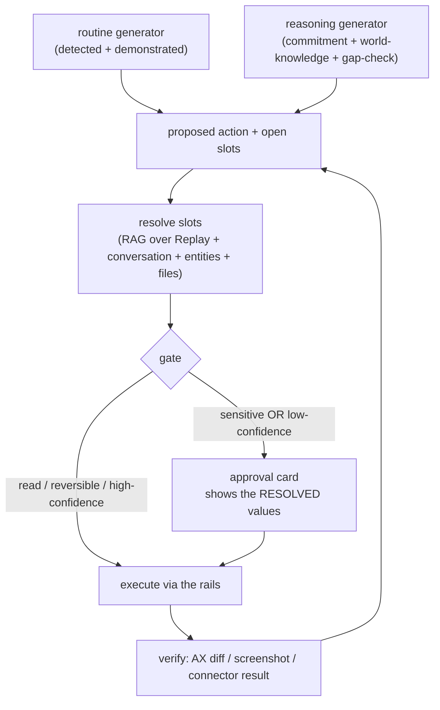

# Off Grid AI - the proactive assistant (the act pillar)

**Status:** product model agreed August 12, 2026. This supersedes the earlier "replicate the mobile-use stack" framing: that described one rail (GUI automation), not the product. The product is a proactive, context-grounded local assistant. Computer use is the last rail it reaches for, not the point.
**Standing constraints:** local models only, nothing leaves the device; all UI and copy follow `off-grid-ai/brand` (see 11).

---

## Current operator experience

Computer Use and Web Use now run as supervised tasks in Off Grid AI Desktop.

1. Start the task from Chat and approve it.
2. When a local Web Use attempt first starts, its task details open once. Off Grid closes the left
   navigation drawer and the Chat workspace so the browser task has the full app window. Back, or a
   terminal task state, restores the earlier layout. Later progress updates do not reopen details
   after you close them.
3. Open **Tasks** to see the durable history on the left.
4. Select a task record to inspect its execution plan and ordered trace. Plan stages group the work
   into outcomes and show the current, completed, and failed stage. The **Live task** pane remains
   clearly labelled and keeps the current run visible.
5. Use **Pause**, **Stop**, or **Take Over** for Computer Use. Escape stops the active task when the
   global shortcut is available.
6. While Web Use or Computer Use is running, use the guidance box to change its next decision.
   Enter sends and Shift+Enter adds a line. Attach a local document or image when it gives useful
   context. The trace shows when guidance is accepted and when the next decision uses it.
7. Use **Return to originating Chat** in task details to reopen the Chat that started the run.

Web Use controls an embedded browser surface. A link clicked in Chat opens as a normal manual browser
tab and does not start automation. Computer Use controls the execution device's current screen and
shows a separate always-on-top supervisor while it runs. Mouse movement does not pause or stop a
task.

Stopping Chat first sends the Stop command to the active Web Use or Computer Use owner. Off Grid
cancels the Chat turn only after that owner accepts Stop. A stop failure stays visible, and Chat does
not pretend the task ended.

Computer Use checks the focused macOS Accessibility element before it types. A secure or unknown
private field stops before actuation and asks you to enter the value, then resume. The helper returns
only `safe`, `secure`, or `unknown`; it does not read the field value. Typed action content is also
redacted before task history, SQLite, or sync. Exact live guidance and attachment content stay in
the active task's memory. History and sync keep only safe accepted/applied markers.

Task records and text traces sync through the Personal Mesh. Screen images and their filesystem paths
stay on the execution device. Another device shows which Mac owns the missing image.

Every Computer Use, Web Use, and accessibility run stops at 200 planning steps. The durable detailed
trace keeps the newest 250 steps. These limits are shared constants, not separate UI defaults.

The real Electron QA journey lives in `scripts/qa-agentic-studio.mjs`, with light/dark evidence in
`e2e/screenshots/agentic-studio`. The August 25 run proved the docked task history, execution-plan
detail, retry, native browser ownership, route hide/restore, keyboard resize, settings, and
device-local evidence copy. It used the earlier semantic Web Use decision fixture. It is not proof
of the current strict visual decision contract. The current vision-first Web Use rerun and a real
Computer Use control run remain open as CU-004.

The Computer Use catalog follows the same filters, model cards, download state, and active-model
rules as the other model tabs. It lists only model packages with a shipped policy adapter, pinned
GGUF, and matching projector.

In Task settings, **Same as Chat** keeps the resident Chat model. **Separate specialist** loads the
selected ready Computer Use model for the task and restores Chat after it ends. The strategy and the
selected specialist sync through the Personal Mesh. The task screen size, detail, checkpoint, and
panel layout remain device-local where hardware or screen geometry makes a shared value unsafe.

### Vision-first pipeline status - August 26, 2026

| Requirement | Code and wiring | Verification state |
| --- | --- | --- |
| Fixed Web Use evidence | Web Use captures only the page viewport from its main-owned `WebContentsView`. App chrome, Chat, and task controls are not in the model image. | Focused capture tests pass. Current real Electron proof is open in CU-004. |
| One model decision | UI-Mate, UI-TARS, and general vision models use one strict direction, milestone, and zero-or-one-action response for each screenshot. The request includes the current Task brief, accepted guidance, milestone, verified actions, recent events, older facts, coordinate bounds, and the screenshot. | Adapter and graph tests pass. Remote paths still have a thinking and privacy gap in CU-015. |
| Response validation | The model boundary rejects missing or extra fields, invalid enum values, malformed JSON, a mismatched verdict, and more than one action. The request has one attempt. | Focused adapter tests pass. |
| Model authority | After a valid model decision approves an action, Web Use does not use DOM text, element counts, labels, or UI phrases to reject it. The browser boundary checks only document freshness, screenshot pixels, coordinate structure, safety policy, and execution results. | A canvas-only page regression proves the approved visual click executes without DOM target resolution. |
| Coordinates and action | Web Use maps inference pixels to the current page viewport by proportion, executes the one approved action through CDP, then returns to a fresh capture. | Mapping, resize, browser-driver, and graph tests pass. |
| Milestones | The Web Use graph advances only on the model's validated `milestone_complete` signal and advances one milestone once. | Focused graph tests pass. Desktop Computer Use still has a separate loop owner; see CU-013. |
| Evidence and model identity | Live details show the run-bound model name, current phase, milestone, operation, final decision, visible evidence, updates, screenshots, mapped actions, and errors. The model identity is stored with the task, so a later global model change cannot relabel it. | Focused main and renderer tests pass. Live visual proof is open in CU-004. |
| Stop and immersive start | Stop in Chat reaches the task owner before Chat cancellation. The first running local Web Use attempt opens its details and closes the left navigation and Chat workspace once. | Focused lifecycle and App navigation tests pass. Live visual proof is open in CU-004. |

The August 26 pipeline sweep passed 15 files and 200 tests, and its node typecheck passed. The later
CU-014 gate passes four files and 58 tests. Its changed browser files have zero scoped lint errors.
The current node typecheck passes. The expanded run has 202 passing tests and one unrelated Chat UI
failure. The standalone desktop `vision-agent.test.ts` run still does not finish. These remaining
test items are not CU-014 regressions. A green focused gate is code evidence, not live Electron or
real-device proof.

Web Use treats an empty or single-colour compositor frame as failed evidence. One capture waits for
up to six seconds and asks Chromium to repaint every 250 ms. The graph then allows two fresh
recoverable observations before it shows the clear blank- or empty-screenshot error. A renderer
reload does not replace the main-owned browser view. An SPA route change, visibility change, or
native-view resize can still leave that view without a painted compositor frame for a short time. A
main-process restart is different: it disposes the browser host, stops the run, and destroys the
view; it cannot continue the same capture.

---

## 1. What we are building

An assistant that **notices what you need and acts on it**, grounded in what OGAD already remembers about your day. Not a chatbot you command, and not a pixel-clicking robot - an assistant that:

- **knows you** - Replay already captures your day (screen -> OCR -> observations -> entities). That memory is the raw material.
- **is proactive** - it surfaces the flight you have not checked in for, the presentation you promised, the routine you run every morning - before you ask.
- **is private** - all of it is on-device. That is the only reason a person would let something watch their whole day, and it is the moat.
- **routes to the cheapest reliable rail** - a deep link or a connector before a scripted action before driving a GUI before pixels. It acts through the app and content you actually mean, resolved from your context - "put on the show we were just talking about, in the app you use" - not a UI-clicking gamble.

The differentiator is that combination, not raw GUI prowess. Local models will not beat frontier cloud agents at clicking arbitrary pixels this year, and chasing that is a trap. Knowing you, noticing, staying private, and routing well is the product.

## 2. Two ways a task is born (the generators)

Every task the assistant acts on comes from one of two generators. Both emit the same thing: **a proposed action with open slots** (the structure is known; the content is filled later, see 4).

### 2.1 Routine proactivity - repetition

The same flow, done again. Two authoring paths, one artifact (a routine = a trigger + an ordered, AX-anchored action trace):

- **Auto-detected** - mined from the Replay observation log: "every weekday ~9am you open Mail then Slack and scan unread." Low fidelity (we know the sequence, not every exact target), so it is used to *propose*, then confirmed by a recording.
- **Demonstrated** - you hit record and do it once. High fidelity: the exact trace, directly replayable. See 5.

Detection *proposes*; demonstration *records the reliable version*. "I noticed you do this every morning - show me once so I can do it exactly." They are one loop, not two features.

### 2.2 Reasoned proactivity - situation

No repetition at all. Given your situation, something *should* have happened and has not. The flight case:

1. **Detect the commitment/event** - "flight tonight" from a conversation Replay captured, or a confirmation email.
2. **Know what it implies** - world knowledge the LLM already has: a flight means check-in, a boarding pass, a gate. Nobody programs "a flight entails check-in."
3. **Gap-check the actual state** - the agent goes and looks, read-only: is there a boarding pass in Gmail? any sign of check-in?
4. **Surface the gap** - "You fly tonight and haven't checked in. Want me to?"
5. **Act, then gate** - check in or open the check-in page; anything with identity or payment confirms first.

Steps 1-4 - the *smart* part - are pure memory + LLM + read-only connectors. No vision, no risky automation. That is the most magical and the most reliable part; it lands early - R2 in the build plan, right after the chat action tool is released (R1). See `COMPUTER_USE_PLAN.md` for the order.

**The routine engine gives reliable *doing*; the reasoning engine gives an assistant that *notices*.** Same spine underneath.

## 3. One gated spine

Both generators feed one path:

- **Resolve** - the slots ("the presentation", "the person I promised") are filled from memory at run time, each with a confidence. This is the "which presentation" intelligence (see 6).
- **Gate** - the approval card shows the *resolved* values: "Send `Q3-strategy.pptx` to Ali Chherawalla." One glance confirms the AI inferred correctly *and* that the action is safe. The gate is where inference and safety are confirmed together - it is the guard against a confident-but-wrong resolution, and the same mechanism handles "is it right" and "is it allowed."
- **Trust graduation** - suggest -> approve-each-run -> auto-run trusted routines. Irreversible steps (send, pay, delete, account-create) gate by default even inside a trusted routine.

## 4. The rail hierarchy - cheapest reliable first

The router picks the cheapest rail that will reliably do the step. Vision is the last resort, not the engine.

| Rail | What it is | Reliability | Status |
| --- | --- | --- | --- |
| 0. Perception | Replay OCR + the accessibility tree - structured "sight", no ML grounding model | n/a | capture ships; AX reader exists |
| 1. Semantic | deep links / URL schemes, AppleScript / Apple Events, EventKit, Shortcuts, MCP connectors | ~100%, deterministic | **built** (calendar, reminders, contacts, messages, mail, open_url) |
| 2. Agent browser | embedded browser pane driven in-process, for novel web tasks (check-in, ordering) | good; no OS permissions | built; live device proof remains open |
| 3. AX-tree GUI | structured native control (AXPress / set-value) + replay of a demonstrated trace | good on well-behaved apps | supervised task rail built; recorder remains open |
| 4. Vision grounding | a downloadable model mapping pixels -> coordinates | the frontier ceiling (~35-45% novel, local) | UI-TARS and UI-Mate adapters built; live device proof remains open |

**Three different things get called "seeing", and only rail 4 is the heavy one:** Replay OCR (rail 0, ships) powers detection and context; the AX tree (rail 0/3, exists) powers precise recording and reliable replay with no ML model; the grounding vision model (rail 4) only earns its place when the AX tree is dead (WhatsApp-class apps) or a recorded step drifted. So the assistant can do a great deal - and ship real value - before rail 4 exists.

Your examples, mapped to rails:

- **Open Maps** - rail 1, `open_url` (`maps://`). Built. Flawless.
- **Call a cab** - rail 1, deep link (`uber://?action=setPickup&dropoff=...`) opens the ride pre-filled; you confirm. Reliable.
- **Put on a movie** - rail 1 if the app has a title deep link (many do); rail 2/4 if it means driving the streaming UI. Mixed.
- **Order from Amazon** - rail 2, the agent browser driving the real site (no consumer API), ideally a pre-authored recipe for the reorder flow, payment behind the gate. Best-effort, improving.

The rule is always: does the service expose a clean surface (deep link / API / connector / AppleScript)? If yes, reliable and cheap. If it is GUI-only, it is the hard long tail - the same ceiling every agent hits, worse with local models. "Does everything" is honest as a direction, delivered as: the clean-surface majority done flawlessly, the GUI long tail done assistively and improving, always honest about confidence.

## 5. The demonstration recorder

Record-by-showing turns "novel GUI automation is ~40% reliable" into "replay a known trace", because replaying a *known* path is a far easier task than figuring out a UI from scratch.

- **Capture the action trace, not raw input** - for each meaningful step: the app, the AX element (fallback coordinate), the action (click/type/scroll/navigate), any typed text. The AX context is what turns a raw click into "clicked Send in Slack" and what makes replay survive window moves and resizes.
- **Primitives we already have** - the CGEvent tap (we ship the *listening* half in dictation-hotkey), the AX reader, and Replay frames for context and step verification. The recorder is Replay-with-intent plus AX-tagging, a new mode, not a new system.
- **Review + edit** - after recording we show the steps in plain language ("Open Slack", "Click Send", "Type: ..."); you delete, reorder, or **mark a step as a variable slot** (see 6).
- **Store** - as a skill with a trigger (manual / schedule / event), reusing the existing skills format.
- **Never record secrets** - secure-input detection (`IsSecureEventInputEnabled()`) hard-skips keystrokes into password fields. Recording credentials would be a serious mistake.

On replay, deterministic trace execution runs through the rails; the LLM/vision comes in only as **recovery** when a step's AX target is gone or a verification fails. Deterministic automation with model fallback is strictly more reliable than model-drives-everything.

## 6. Memory-grounded resolution (the recording gives the *how*, memory gives the *what*)

A demonstrated trace stores the reliable UI path but leaves the content open. The slots - "the presentation I mentioned", "the person I promised" - resolve at run time by RAG over the memory spine: Replay observations + recent conversation + entity graph + files you touched, scoped by temporal and entity proximity, returning a value **plus a confidence**.

- A generic assistant cannot do "send the deck I promised" - it has no record of your day. OGAD can, because it has both halves (the memory and the action).
- **Confidence drives the gate**: high + non-sensitive -> preview-and-go; sensitive -> gate with the resolved preview; ambiguous ("which of three decks?") -> disambiguate or show the top candidate for one-tap confirm.
- **Honest edges**: recency window needs temporal decay (grab *this* deck, not last month's); resolution quality rises and falls with what Replay captured (a healthy incentive to invest in memory); the dangerous case is confident-and-wrong, which the preview-at-gate catches for sensitive actions and a higher confidence bar catches for auto-run.

**Slot resolution (data, from memory) is a different intelligence from UI-drift recovery (elements, from AX + vision).** Keep them separate: one finds content, one finds buttons.

## 7. What is already built (the reliable foundation)

The semantic rail and the shared gate exist on this branch (11 commits), and they are exactly the reliable execution layer this assistant needs:

- **Transport-agnostic approval seam** - `actions:proposeApproval` with a read/navigate/mutate/irreversible risk taxonomy; the single gate every rail routes through. Backward-compatible with the current pro build.
- **Native actions helper (macOS)** - one Swift one-shot backend behind `runNativeAction`, covering calendar (create/list), reminders (create/list), contacts (search), Messages send, Mail send, and `open_url`. Mutations gate; reads run free; lenient date parsing; AppleScript values escaped against injection.
- **Wired into the chat tool loop** macOS-only, and shipped in CI. Fully unit-tested through an injected boundary.
- **TCC packaging** - the Info.plist usage strings and apple-events entitlement a signed build needs, brand-clean, guarded by a test.

None of this is wasted by the reframe. It is rail 1, and rail 1 carries most of the value.

## 8. What is genuinely new to build

On top of the existing foundation. **The build order and schedule live in `COMPUTER_USE_PLAN.md` (the build doc), which sequences these as releases R1-R4** - the chat action tool ships first (R1, the lead's steer), then the reasoning/resolve layer, then routines, then the hard rails. Mapped to the releases:

- **R1 - the chat action tool + the durable spine.** Turn the existing semantic rail (7) into a released, gated, verified tool the chat model calls, on a durable Action queue + state machine. This is the released foundation the rest layers on.
- **R2 - the reasoning engine + the slot/resolve layer.** Commitment/event detection + world-knowledge of required steps + read-only gap-checking + surfacing (the magic, and the safest - no risky automation); and RAG over the memory spine to fill "the presentation" with a confidence.
- **R3 - the demonstration recorder + the routine store.** Record-by-showing (recorder + AX tagging + review UI, see 5) and skills with schedule/event triggers; auto-detection feeds the "record this?" proposal.
- **R4 - the agent browser (rail 2) + the AX act-primitives and grounding vision model (rails 3-4).** The reasoned novel web tasks (check-in, ordering) and the dead-AX / drift-recovery fallback. Last.

## 9. What we reuse (do not reinvent)

This is the curated shortlist. The deep, component-by-component port map for the whole system (durable queue, brain, memory, routines, rails, models) with a port-vs-bespoke verdict per component lives in `PORTING_MAP.md`.

| Source | License | What we take |
| --- | --- | --- |
| `@ui-tars/sdk` + the UI-TARS desktop app | Apache-2.0 | Operator seam + action parser; the ScreenMarker overlay trio (animated border, content-protected control widget, pre-action markers); desktopCapturer scaling; the macOS permission gate |
| nanobrowser | Apache-2.0 | TypeScript DOM-to-indexed-elements serialization for the agent browser |
| `@computer-use/nut-js` (or the community fork) | Apache-2.0 | input synthesis on the native rail |
| macos-automator-mcp | MIT | wrapped AppleScript/JXA intents plus its recipe knowledge base |
| bytebot (archived) | Apache-2.0 | takeover-as-recorded-actions (the human demonstration lands in the same action log) and the needs_help state - directly relevant to the recorder |
| Peekaboo (OpenClaw org) | MIT | reference for the AX-tree + vision hybrid on the native rail |
| OpenAdapt (MLDSAI) | MIT | the recorder / routines rail (R3): record once -> deterministic, self-healing local replay; each step carries a template crop, an OCR label, geometry, a structural locator, and postconditions (our per-step verify), and the model touches the script only to repair on drift. Port the trace format + self-heal rather than build one. |
| FlaUI / pywinauto | MIT / BSD-3 | the Windows UI Automation act-primitives reference for the accessibility rail (R3 Windows fast-follow) - UIA2/UIA3 element find + invoke / set-value, the analogue of the macOS AX act-primitives |
| Agent-S2 (Simular) | Apache-2.0 | open computer-use agent loop + router structure as a reference for the brain |
| OpenClaw | AGPL (patterns only) | the proactive cron/skills pattern and the killer briefing workflow; equally its incident record as the avoid-list (exposed gateways, sandbox-off, weak auth, unvetted skills) - we ship none of those surfaces |

Everything adopted as code is Apache-2.0, MIT, or BSD - clean for the AGPL core + proprietary pro split (verify each license at the point of adoption; minitap/mobile-use asks for attribution).

### Mobile (the adapter after v1)

Mobile is a `DeviceController` adapter on the same engine (Section 6 and `ASSISTANT_ARCHITECTURE.md`), not a rewrite - and the actuation layer already exists to port rather than build:

| Source | License | What we take |
| --- | --- | --- |
| Mobilerun (droidrun) | MIT | the mobile actuation rail for Android + iOS: inspect UI state, screenshot, tap / swipe / type, model-agnostic and local-model-capable (Ollama / OpenAI-compatible). The mobile `DeviceController` wraps this instead of writing driver glue. |
| minitap/mobile-use | Apache-2.0 (credit Minitap) | the mobile agent loop reference (first to 100% on AndroidWorld), a LangGraph multi-agent over low-level control |
| AppAgent / AppAgent-v2 (Tencent) | MIT | learn-by-demonstration + tagged-element perception (numeric tags over the Android view hierarchy) - mobile routines by showing |
| Mobile-Agent-v3 / GUI-Owl (X-PLUG) | MIT | full mobile agent reference + GUI-Owl as the shared grounding model (desktop + mobile trained) |
| Appium + appium-webdriveragent (iOS) + UiAutomator2 (Android) | Apache-2.0 | the low-level device drivers under the mobile rail (iOS via WebDriverAgent / XCTest, Android via UiAutomator2) |
| Maestro (mobile.dev) | Apache-2.0 | the YAML flow format as inspiration for the mobile routine trace |

iOS stays intents-only for driving other apps (App Intents / Shortcuts) - Apple forbids reading or driving other apps, so the mobile GUI / vision rails are Android-first, exactly as the plan states.

## 10. Safety

- The **gate** is the confirmation of inference and safety together (3): irreversible classes (send, pay, delete, account-create) confirm even inside trusted routines; the card shows resolved values so a confident-but-wrong resolution is caught before it acts.
- **Screen content is untrusted input** - published studies show 86% attack success from adversarial pop-ups against GUI agents; prompt-level defenses fail, so the gate and an app allowlist are system-level.
- **Never see or type credentials** - secure-input detection hands password fields to the user; the recorder hard-skips them.
- **Takeover with a guarantee** - at logins and payments the agent pauses and frame capture stops while the user controls the surface.
- **Kill switch** - visible Stop and Escape halt execution. Pause and Take Over park it until an
  explicit Resume. Mouse movement does not change task state.
- **Everything executed lands in the approvals audit log.**
- **Trust graduates** - suggest -> approve-each -> auto-run; never jump to autonomous (the OpenClaw MoltMatch lesson).

## 11. Build guidelines (binding, all surfaces)

- **Design** - `off-grid-ai/brand` `DESIGN_PHILOSOPHY.md`: brutalist/terminal, Menlo, emerald as the only accent, black/white base, hierarchy by size and weight not color, no gradients, no emojis. All values from `@offgrid/design` tokens (`off-grid-ai/shared`) - no hardcoded hex. Desktop density per this repo's `docs/DESIGN.md`.
- **Copy** - `off-grid-ai/brand` `brand_tone_voice.md` + the outcomes-first rule: lead with what the user gets, mechanism as proof; no em dashes, no curly quotes, no exclamation marks, banned-word list applies. Applies to every approval card, suggestion, and notification.

## 12. Open-core placement

Rail-1 helper primitives and adapter plumbing are core infrastructure (like OCR). The reasoning engine, the recorder, the routine store, the resolve layer, and the approvals integration follow the existing pro spine. `pro/` changes land in `desktop-pro` first, submodule bump after. The engine (agent loop / router / resolver) lives in `off-grid-ai/shared` as `@offgrid/use`, consumed via `file:../shared/packages/use`.

## 13. Decisions and open questions

1. **Decided** - the model above: two generators (routine + reasoned) on one gated spine, rails cheapest-first, memory-grounded resolution, vision last.
2. **Decided** - `@offgrid/use` package name and `file:../shared/packages/use` consumption; the sibling `../shared` checkout is a build requirement (main already adopted it).
3. **Decided** - the semantic rail (rail 1) is the foundation and is built.
4. **Open** - parameterization depth: start faithful-with-marked-slots resolved by memory, layer richer LLM generalization on top. Confirmed lean: start faithful.
5. **Decided** - build order is release-led (`COMPUTER_USE_PLAN.md`): the chat action tool + durable spine ships first (R1, the lead's steer), then the reasoning + resolve layer (R2), then routines (R3), then the hard rails (R4).
6. **Decided** (per `PORTING_MAP.md` Section 6) - the default grounding model is UI-TARS-1.5-7B on desktop (Apache-2.0, GGUF + mmproj already published and mainline-runnable); GUI-Owl-1.5 / Qwen3-VL for mobile. Still not on the critical path (R4).

## 14. Sources

- Mobile-use agent loop: minitap/mobile-use (100% AndroidWorld) https://github.com/minitap-ai/mobile-use ; Mobile-Agent-v3 / GUI-Owl https://github.com/X-PLUG/MobileAgent
- Product UX: Claude Desktop browser pane https://code.claude.com/docs/en/desktop ; Codex embedded browser https://chierhu.medium.com/openai-codexs-browser-use-feature-b7dffa761d45 ; browser-use raw CDP https://browser-use.com/posts/playwright-to-cdp ; nanobrowser https://github.com/nanobrowser/nanobrowser ; UI-TARS desktop https://github.com/bytedance/UI-TARS-desktop ; bytebot takeover https://github.com/bytebot-ai/bytebot
- OpenClaw teardown: https://github.com/openclaw/openclaw ; Peekaboo https://github.com/openclaw/Peekaboo ; exposed gateways https://www.bitsight.com/blog/openclaw-ai-security-risks-exposed-instances
- Reliability calibration: OSWorld https://os-world.github.io/ ; pop-up injection (86%) arXiv:2411.02391
- Grounding models: GUI-Owl-1.5-8B https://huggingface.co/mPLUG/GUI-Owl-1.5-8B-Instruct ; Qwen3-VL grounding arXiv:2511.21631 ; Holo3.1 https://huggingface.co/blog/Hcompany/holo31
- macOS surface: Electron `AXManualAccessibility` https://www.electronjs.org/docs/latest/tutorial/accessibility/ ; secure input TN2150 https://developer.apple.com/library/mac/technotes/tn2150/_index.html ; Electron debugger https://www.electronjs.org/docs/latest/api/debugger ; node-mac-permissions https://github.com/codebytere/node-mac-permissions
- Brand: https://github.com/off-grid-ai/brand ; `@offgrid/design` in https://github.com/off-grid-ai/shared
