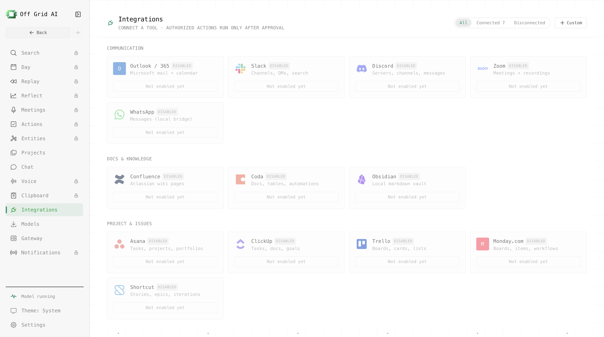

# Connectors (MCP)

[← All features](../FEATURES.md)

Use [Model Context Protocol](https://modelcontextprotocol.io) servers right inside chat.

- **Add your own** via three auth modes: **none**, **token** (stored in the OS keychain via
  `safeStorage`), or **OAuth** (browser flow).
- **Preset catalogue** — one-tap setup for common servers.
- **In chat** — turn **Connectors** on in the composer; the model can call connector tools,
  reads run inline.
- Transports: hosted **HTTP** and local **stdio** servers.

## Connect Gmail and Google Calendar with your own Google client

Your own Google OAuth client lets Off Grid connect directly to Gmail and Google Calendar. Off Grid
stores the client credentials with the operating system protected credential store. Google data moves
between this device and Google.

### Before you start

- You need a Google Cloud project that you can configure.
- You need permission to enable the Gmail API and Google Calendar API.
- If the consent screen is in test mode, add the Google account that you will connect as a test user.
- Create an OAuth client with the **Web application** type. A Desktop application client does not use
  the callback that Off Grid requires.

### Configure Google Cloud

1. Open [Google Cloud credentials](https://console.cloud.google.com/apis/credentials) and select or
   create the project that will own the client.
2. Enable the [Gmail API](https://console.cloud.google.com/apis/library/gmail.googleapis.com).
3. Enable the [Google Calendar API](https://console.cloud.google.com/apis/library/calendar-json.googleapis.com).
4. Configure the [OAuth consent screen](https://console.cloud.google.com/apis/credentials/consent).
   Select the audience that your Google organization permits. For an External app in test mode, add
   your Google account under **Test users**. Complete any approval that your organization requires.
5. Select **Create credentials > OAuth client ID**.
6. Select **Web application**.
7. Add this exact authorized redirect URI:

   `http://127.0.0.1:33418/callback`

   This is the callback shown in the Off Grid setup panel. The release source is
   `src/shared/mcp-oauth-callback.ts`. Do not select another port or change the path.
8. Create the client. Copy its Client ID and Client secret. The Project ID is optional.

### Save and connect

1. Open **Settings > Connectors** in Off Grid.
2. Open the Google client setup panel.
3. Enter the Client ID and Client secret. Enter the Project ID if you use it for project records.
4. Select **Save client**.
5. Select Gmail or Google Calendar, then select **Connect**.
6. Sign in in the browser and approve the requested access. Return to Off Grid after Google sends the
   browser to the local callback.

When setup succeeds, the setup card says **Your Google client**. The connector moves to
**Connected**, and its connection test succeeds. If you change the Google client, consent audience,
or test users, save the client again and reconnect each Google connector.
