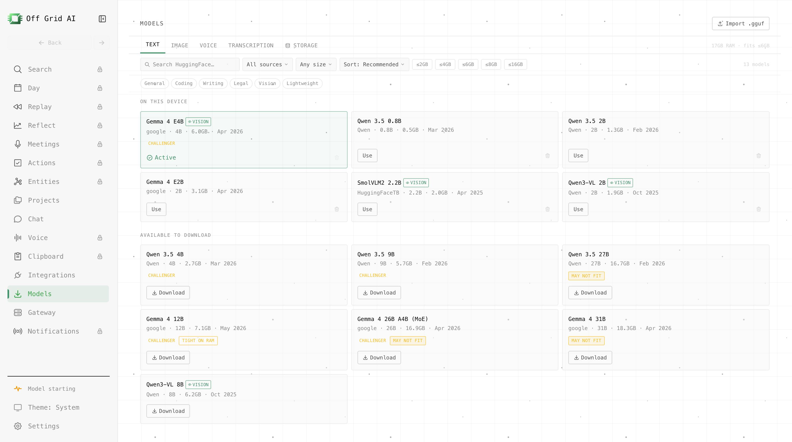

# Models

[← All features](../FEATURES.md)

Model business rules are owned by the shared
[`@offgrid/models`](../../../shared/packages/models/README.md) control plane. Desktop supplies the
Electron, Node, file, database, network, and inference-engine adapters. Desktop UI renders the
shared inventory, selection, download, generation, and residency projections and sends user intent;
it does not define a second provider, fallback, budget, or model-selection policy.

- **Catalog** with curated, **size-bucketed** recommendations (≤2/4/6/8/16 GB) per modality
  (text, vision, image, voice, transcription) — compete-with-LM-Studio picks, with release
  dates and credibility tiers (official / verified / community / Off Grid AI).
- **Direct Hugging Face search**, scoped to the focused modality; auto-detects GGUF / GGML /
  ONNX variants.
- **Download manager** - progress, cancel, and a per-modality **active model** that the
  gateway loads on demand. After a restart, an interrupted download stays stopped and offers Retry.
  Desktop resumes automatically only when a verified native transfer still owns the work.
- **Voice** - Desktop uses the Shared Kokoro identity through its local ExecuTorch adapter. Opening
  Chat or listing voices does not download or load speech assets. The first Speak request prepares
  the assets on demand.
- Off Grid AI publishes correctly-converted SDXL GGUFs under the
  [`offgrid-ai`](https://huggingface.co/offgrid-ai) org.
